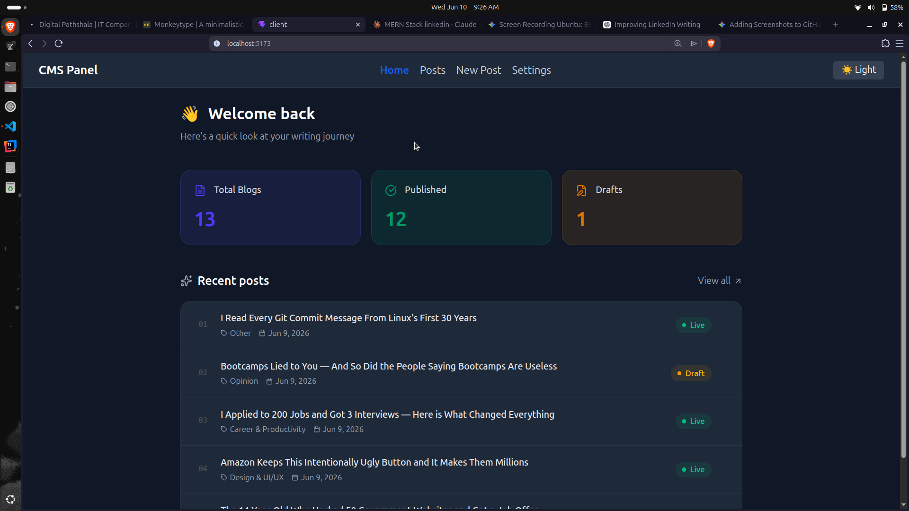

# MERN CMS

A full-stack Content Management System built with the MERN stack. Create, read, update, and delete blog posts through a clean React frontend connected to a Node.js + Express backend and MongoDB database.

---

## Features

- Create, edit, and delete blog posts
- View all blogs and individual blog detail pages
- Real-time dashboard with post statistics
- Dark / Light mode toggle (persisted in localStorage)
- Category tagging and publish/draft status
- Responsive UI with Tailwind CSS
- RESTful API with proper status codes and error handling

---

## Tech Stack

**Frontend**
- React (Vite)
- React Router DOM
- Axios
- Tailwind CSS
- Context API (theme management)

**Backend**
- Node.js
- Express.js
- Mongoose

**Database**
- MongoDB Atlas

---

## Project Structure

```
mern-cms/
├── client/                 # React frontend
│   └── src/
│       ├── components/     # Navbar, reusable UI
│       ├── context/        # ThemeContext
│       ├── hooks/
│       ├── pages/          # Home, Posts, NewPost, BlogDetail, Settings
│       ├── services/       # blogService.js (Axios API calls)
│       └── utils/
└── server/                 # Express backend
    └── src/
        ├── models/         # Blog Mongoose model
        └── index.js        # Express app + routes
```

---

## Getting Started

### Prerequisites

- Node.js
- MongoDB Atlas account

### Installation

1. **Clone the repository**

```bash
git clone https://github.com/RaiYunan/mern-cms.git
cd mern-cms
```

2. **Setup the backend**

```bash
cd server
npm install
```

Create a `.env` file in `/server`:

```env
MONGO_DB_URI=your_mongodb_atlas_connection_string
PORT=3000
```

```bash
npm run dev
```

3. **Setup the frontend**

```bash
cd client
npm install
npm run dev
```

4. Open `http://localhost:5173` in your browser.

---

## API Endpoints

| Method | Endpoint | Description |
|--------|----------|-------------|
| GET | `/blogs` | Get all blogs |
| GET | `/blog/:id` | Get single blog |
| POST | `/createBlog` | Create a new blog |
| PATCH | `/blog/:id` | Update a blog |
| DELETE | `/blog/:id` | Delete a blog |

---

## Screenshots


<table width="100%">
  <tr>
    <td width="50%" align="center">
      <b>Dashboard Statistics</b><br/>
      
    </td>
    <td width="50%" align="center">
      <b>Create Blog Page</b><br/>
      
    </td>
  </tr>
</table>

---

## Learning Context

Built as part of the **Digital Pathshala MERN Stack Workshop** over 10 days.

---

## License

MIT